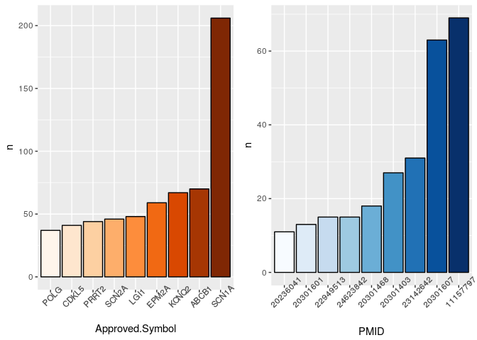
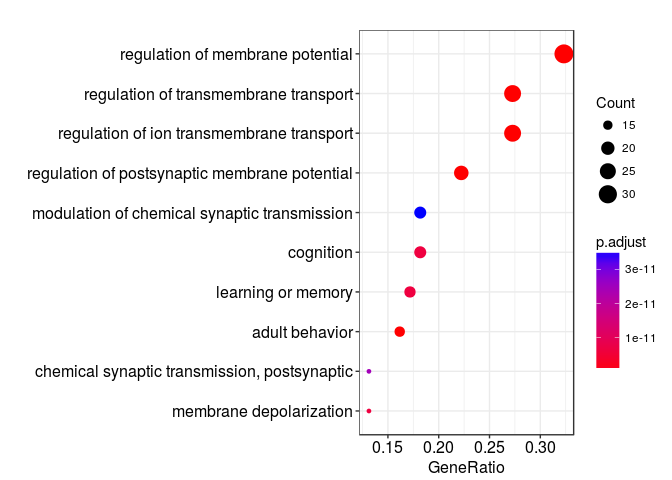

PubMed Literature Mining with R
================

Here we use pubmed to find a set of literature-derived '**disease genes**'. This is a handy analysis, as sometimes getting a list of genes for a particular disease can be harder than you would expect (e.g., resources fall out of date, information summarized in pdf formatted tables).

Load
----

The getIDs function takes in a term and uses PubMeds API to query for IDs of articles (PMIDs) associated w/ that term.

``` r
library(tm)
library(openNLP)
library(ggplot2)
library(gridExtra)
library(RColorBrewer)
library(tidyverse)
library(clusterProfiler)
library(knitr)


getIDs = function(term){
  require(XML)
  require(httr)
  
  ## clean up input
  term = gsub(" ","+",term,ignore.case = FALSE)
  term = gsub("/",".",term)
  term = gsub('"',"%22",term)
  term = gsub("'","%27",term)
  term = gsub("-","%2D",term)
  
  ## construct the URL query
  base.url = "http://eutils.ncbi.nlm.nih.gov/entrez/eutils/esearch.fcgi?db=pubmed&usehistroy=y"
  url = paste(base.url,"&term=",term,"&retmax=1",sep="")
  
  ## determine the total number of papers
  doc = XML::xmlTreeParse(rawToChar(GET(url)$content), useInternal=TRUE)
  root = XML::xmlRoot(doc)
  retmax = as.numeric(XML::xmlValue(root[[1]]))
  
  ## query again, this time setting retmax to the total
  ## number of articles
  url = paste(base.url,"&term=",term,"&retmax=",retmax,sep="")
  doc = XML::xmlTreeParse(rawToChar(GET(url)$content),useInternalNodes=T)
  
  ## use XPath to extract the IDs from the XML document
  a = XML::xpathApply(doc,"//IdList/Id",XML::xmlValue)
  out = unlist(a)
  
  return(out)
}
```

PMID to gene mapping
--------------------

We first load in a table which contains a mapping of PMIDs to entrez gene symbols (file A). 'File A' is titled 'gene2pubmed.gz' and can be downloaded from <ftp://ftp.ncbi.nlm.nih.gov/gene/DATA/> . Make sure you filter this table for your organism of interest. We are interested in human genes, thus we are filtering on org = 9606. For display purposes, we will also convert Entrez gene IDs to HGNC gene symbols. While packages like biomaRt can be used for this, I prefer to use a static, local file for this conversion (file B). This can be downloaded from <https://www.genenames.org/cgi-bin/download>.

``` r
# load pubmed/gene table and filter for human organism ID
# use above links to get file
# file A
load('/wdata/lbrueggeman/functions/literature_data/genes2PMID_homologene.Rdata')
lit = lit[lit$org == 9606,]

# load entrez/HGNC table and switch EntrezID from int to character type
# use above links to get file, then replace path
# file B
hgmap = read.csv('/wdata/lbrueggeman/data/genomes/entrez_hgnc_map.txt',sep='\t') %>% mutate(Entrez.Gene.ID = as.character(Entrez.Gene.ID))

# switch to HGNC for the pubmed/gene table
lit = left_join(lit,
                hgmap[,c('Approved.Symbol','Entrez.Gene.ID')],
                by=c('EntrezID' = 'Entrez.Gene.ID')) %>%
      dplyr::select(-one_of('EntrezID')) %>%
      unique() %>%
      drop_na()

kable(lit[1:5,])
```

|   org|      PMID| Approved.Symbol |
|-----:|---------:|:----------------|
|  9606|   2591067| A1BG            |
|  9606|   3458201| A1BG            |
|  9606|   3610142| A1BG            |
|  9606|   8889549| A1BG            |
|  9606|  12477932| A1BG            |

Query PubMed API for term-associated PMIDs
------------------------------------------

Once we have our term-associated PMIDs, we can then filter our PMID-gene pairing object to only include PMIDs which are associated with epilepsy. We then plot the highest cited genes and the PMIDs of papers citing the greatest number of genes. In some cases, you may want to divide each genes epilepsy mentions by total mentions across all literature, for a more epilepsy-specific ranking.

``` r
ep = suppressMessages(getIDs('epilepsy'))
eplit = lit[lit$PMID %in% ep,]

p1 = eplit %>% group_by(Approved.Symbol) %>% summarise(n=n()) %>% ungroup() %>% arrange(.,n) %>% mutate(Approved.Symbol = factor(Approved.Symbol, levels=Approved.Symbol)) %>% tail(9) %>% ggplot(., aes(x=Approved.Symbol, y=n)) + geom_bar(stat='identity', fill=brewer.pal(9, 'Oranges'), color = 'black') + theme(axis.text.x = element_text(angle=45))
p2 = eplit %>% group_by(PMID) %>% summarise(n=n()) %>% ungroup() %>% arrange(.,n) %>% mutate(PMID = factor(PMID, levels=PMID)) %>% tail(9) %>% ggplot(., aes(x=PMID, y=n)) + geom_bar(stat='identity', fill=brewer.pal(9, 'Blues'), color = 'black') + theme(axis.text.x = element_text(angle=45))

grid.arrange(p1,p2, nrow=1)
```



Gene set enrichment analysis of top genes
-----------------------------------------

As a minor validation of our top genes, we find the enriched GO terms in the top 100 genes.

``` r
g = eplit %>% group_by(Approved.Symbol) %>% summarise(n=n()) %>% arrange(n) %>% tail(100) %>% dplyr::select(one_of('Approved.Symbol')) %>% unlist() %>% as.vector()

gset = suppressMessages(enrichGO(g, OrgDb = 'org.Hs.eg.db', ont='ALL', keyType = 'SYMBOL'))
dotplot(gset)
```



As you can see, the GO terms enriched in our top 100 genes certainly have values we would expect given we are interested in the epilepsy phenotype. This approach can be easily adopted for any trait or disease.

#### Thanks for reading!

#### Leo Brueggeman @LeoBman
